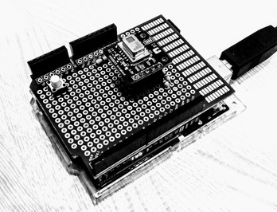
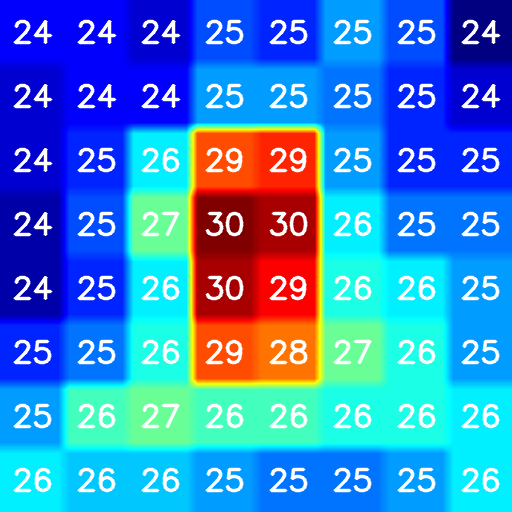

# Arduino with infrared array sensor



(Work in progress)

AMG8833 is an infrared array sensor product from Panasonic. It is very popular among Arduino users.

## Development environment

- Arduino IDE on RasPi 3.
- vi and g++ on RasPi 3.
- OpenCV3 for thermography GUI development.

Note: you have to install OpenCV3 on Raspi3. In my case, I built OpenCV3 on RasPi3 taking a half day.

## Architecture

```
    [GUI/RasPi3]/dev/ttyACMX----VCP/USB----[Arduino]----I2C----[AMG8833]
```

## Arduino shield of AMG8833

==>[schematic](./kicad)

Note: the shield is powered by 3V3 pin on Arduino UNO. Although Arduino UNO is a 5V system, the circuit works.

## Code

- [Arduino](./arduino)
- [RasPi](./raspi)

## Building and running GUI



This is me!

```
$ cd raspi
$ make
$ bin/thermo
```

Note: "thermo" command must be excuted with superuser priviledge for the first time (after every system boot) to set the parameters to the tty port.
