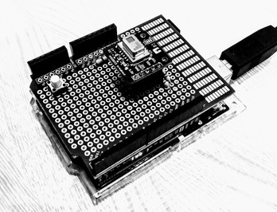

# Arduino with Infrared Array Sensor (AMG8833)



> **Project Background & Retrospective**:  
> When this project was first created in **2019**—in the pre-generative AI era—the author put tremendous effort into hand-crafting every line of the native C++/OpenCV3 code and Arduino sketch from scratch.  
> Today, revisiting this project with the assistance of **Antigravity**, the entire architecture was modernized around an **Arduino + Python** workflow, firmware timing was made rock-solid, and an interactive thermal GUI viewer was produced in a fraction of the time with remarkably superior code quality. It is a remarkable testament to how generative AI has transformed software development—enabling developers to elevate and rebuild projects with unprecedented speed and excellence.

[AMG8833 (Grid-EYE)](https://cdn-learn.adafruit.com/assets/assets/000/043/261/original/Grid-EYE_SPECIFICATIONS%28Reference%29.pdf?1498680225) is an 8x8 infrared array thermopile sensor from Panasonic. This project provides a complete real-time thermal camera system using Arduino UNO and interactive cross-platform Python viewers.

---

## System Architecture


```

[AMG8833 Sensor] --I2C (400kHz)--> [Arduino UNO] --USB Serial (115200bps)--> [Python GUI Viewer]

```

- **Arduino UNO**: Reads 8x8 thermal pixels over I2C at 400kHz, formats frames at 10 FPS with non-blocking timing, and streams data over USB Serial.
- **Python Viewers**: Cross-platform interactive thermal camera applications (macOS, Linux, Windows) with auto port detection, real-time colormaps, frame diffing, motion analysis, and gesture recognition.

---

## Hardware & Shield

- **Schematic**: [kicad/arduino_board.pdf](./kicad/arduino_board.pdf)
- **KiCad Design Files**: [kicad/](./kicad/)

> **Note**: The shield is powered by the `3V3` pin of the Arduino UNO. Although Arduino UNO is a 5V logic system, the I2C interface communicates reliably.

---

## Data Frame Format (VCP / USB Serial)

The Arduino transmits 8x8 pixel frames (raster scan) at 10 FPS with the following packet structure:


```

[BEGIN (0xFE)][byte#0] ... [byte#63][END (0xFF)]

```

- **Resolution / Scale**: Each byte represents temperature in 0.25°C increments (`Temperature (°C) = byte / 4`).
- **Delimiter Protection**: Pixel bytes are clamped to `0xFD` (~63.25°C) to prevent frame synchronization collisions with `0xFE` (BEGIN) and `0xFF` (END).

---

## Quick Start

### 1. Upload Arduino Firmware

1. Connect your Arduino UNO to your computer.
2. Open [`arduino/sketch_amg8833/sketch_amg8833.ino`](./arduino/sketch_amg8833/sketch_amg8833.ino) in the Arduino IDE.
3. Select board `Arduino Uno` and the corresponding serial port.
4. Upload the sketch.

### 2. Launch Python Thermal Viewer

Install dependencies and run either viewer application:

```bash
# 1. Install dependencies
pip install -r python/requirements.txt

# 2. Run the main viewer (auto-detects Arduino port)
python python/viewer.py

# Or run the compact swipe gesture viewer
python python/viewer_swipe.py

```

---

## Python Thermal Viewer Applications

### 1. Main Thermal Camera Viewer (`python/viewer.py`)

* **Auto Serial Port Detection**: Detects Arduino/USB serial devices on macOS, Linux, and Windows automatically.
* **Interpolation & Smoothing**: Toggle between smooth Gaussian interpolation and sharp 8x8 pixel matrix.
* **Colormap Selection**: Easily switch colormaps (`JET`, `HOT`, `INFERNO`, `PLASMA`, `COOLWARM`, `VIRIDIS`).
* **Temperature Overlay**: Display real-time numeric temperature values (°C) overlaid on each pixel.
* **Dynamic Auto Scale & Sliders**: Adjust `vmin` / `vmax` limits manually or toggle dynamic auto-scaling.
* **Binarization & Island Labeling**: Real-time connected-component analysis for occupant / object counting.
* **Frame Difference (Motion Detection)**: Temporal gradient diffing to highlight moving heat sources. Includes an interactive **Diff: 10x / 1x** toggle button to scale temperature differences by 10x across both the colormap heatmap and numerical overlay.

#### Control Panel Reference

| Control Button | Function |
| --- | --- |
| **`Auto Scale`** | Toggle dynamic min/max color-scale adaptation. |
| **`Smooth`** | Toggle Gaussian smoothing vs. raw 8x8 matrix. |
| **`Diff`** | Toggle frame-difference motion detection mode. |
| **`Diff: 10x / 1x`** | Switch motion difference magnification (10x vs 1x). |
| **`Cmap ▾`** | Select colormap from dropdown menu. |
| **`Binarize`** | Object thresholding and connected-component labeling. |
| **`Show Temp`** | Display numerical temperature/label on each pixel. |
| **`Quit`** | Safely close the viewer and release serial port. |
| **Sliders (`Min / Max Temp`)** | Manually adjust colorbar temperature limits (°C). |

---

### 2. Compact Thermal Diff & Swipe Gesture Viewer (`python/viewer_swipe.py`)

A specialized, ultra-lightweight thermal difference visualizer featuring real-time horizontal hand gesture recognition.

* **Thermal Differential Mode**: Focuses purely on frame-to-frame thermal variations without spatial interpolation (`interpolation="nearest"`).
* **Swipe Gesture Detection**: Employs Farneback optical flow over thermal gradients to accurately classify `SWIPE LEFT` and `SWIPE RIGHT` gestures.
* **Sensitivity Threshold Selection**: Interactive drop-down menu (`Thresh: 1.0 ▾`) allowing on-the-fly adjustment of gesture detection sensitivity (`Low 0.5`, `Medium 1.0`, `High 1.5`, `Ultra 2.0`).
* **Streamlined Single-Window Layout**: Compact single window containing 10x differential magnification toggle, text overlay, sensitivity drop-down menu, and quit button.

---

## Repository Structure

* **[`arduino/`](https://www.google.com/search?q=./arduino)**: Arduino UNO firmware sketch ([`sketch_amg8833.ino`](https://www.google.com/search?q=./arduino/sketch_amg8833/sketch_amg8833.ino)).
* **[`python/`](https://www.google.com/search?q=./python)**: Cross-platform Python thermal viewer applications:
* [`viewer.py`](https://www.google.com/search?q=./python/viewer.py): Feature-rich interactive thermal camera viewer.
* [`viewer_swipe.py`](https://www.google.com/search?q=./python/viewer_swipe.py): Compact thermal differential & gesture recognition viewer.


* **[`kicad/`](https://www.google.com/search?q=./kicad)**: Hardware schematic and PCB shield design files.
* **[`raspi/`](https://www.google.com/search?q=./raspi)**: *(Maintenance Mode)* Legacy native C++/OpenCV3 viewer for Raspberry Pi 3. See **[raspi/README.md](https://www.google.com/search?q=./raspi/README.md)** for build instructions and legacy documentation.

---

## License

This project is licensed under the Apache License 2.0 - see the [LICENSE](https://www.google.com/search?q=./LICENSE) file for details.
