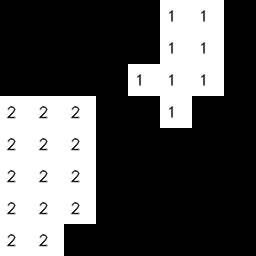

# Arduino with infrared array sensor


[AMG8833](https://cdn-learn.adafruit.com/assets/assets/000/043/261/original/Grid-EYE_SPECIFICATIONS%28Reference%29.pdf?1498680225) is an infrared array sensor product from Panasonic. It is very popular among Arduino users.

## Development environment

- Arduino IDE on RasPi 3.
- vi and g++ on RasPi 3.
- OpenCV3 for thermography GUI development.
- OpenCV4 and Android Studio for GUI development on Android.

Note: you have to install OpenCV3 on Raspi3. In my case, I built OpenCV3 on RasPi3 taking a half day.

## Architecture

```
    [GUI/RasPi3]/dev/ttyACM0----VCP/USB----[Arduino]----I2C----[AMG8833]
```
## Data frame format (raster-scan 8x8 pixel image) over VCP/USB

The program on Arduino transfers 8x8 pixel image data to RasPi over VCP/USB at 10fps in the following data format:

```
   [BEGIN(0xFE)][byte#0]...[byte#63][END(0xFF)]
```
## Arduino shield of AMG8833

=> [schematic](./kicad/arduino_board.pdf)

Note: the shield is powered by 3V3 pin on Arduino UNO. Although Arduino UNO is a 5V system, the circuit works.

## Code

- [Arduino](./arduino)
- [RasPi](./raspi)

## Building and running GUI on Raspberry Pi


This is me!

```
$ cd raspi
$ make
$ bin/thermo -m 64 -t -b
```

GUI developed in a native language (C/C++) runs fast on RasPi 3!

### Bicubic interpolation

The resolution of AMG8833 is only 8x8 pixels. I applied bicubic interpolation to the original 8x8 pixel image for higher resolution.


This is my right hand.

```
$ bin/thermo -m 1 -i 3
```

With "-H" option, the GUI uses COLORMAP_HOT instead COLORMAP_JET:


```
$ bin/thermo -m 3 -i 2 -H -b
```

### Binarization

The GUI supports binarization, useful for counting the number of people in a room:



```
$ bin/thermo -m 32 -H -B
```

### Diff between frames: gradient(=velocity)

The GUI supports image diff between frames, useful for detecting motion of something:


Waving my hand over the sensor.

```
$ bin/thermo -m 32 -d
```

## Running GUI on Android

(Work in progress)

### OpenCV setup for Android

Reference: ["A Beginner’s Guide to Setting up OpenCV Android Library on Android Studio"](https://android.jlelse.eu/a-beginners-guide-to-setting-up-opencv-android-library-on-android-studio-19794e220f3c)

In this project, I use "opencv-4.4.0-android-sdk.zip" from SOURCE FORGE: https://sourceforge.net/projects/opencvlibrary/files/4.4.0/

