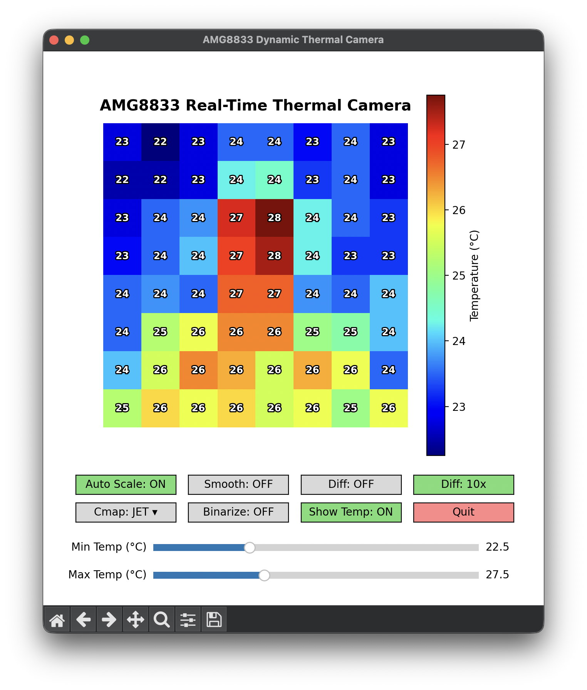
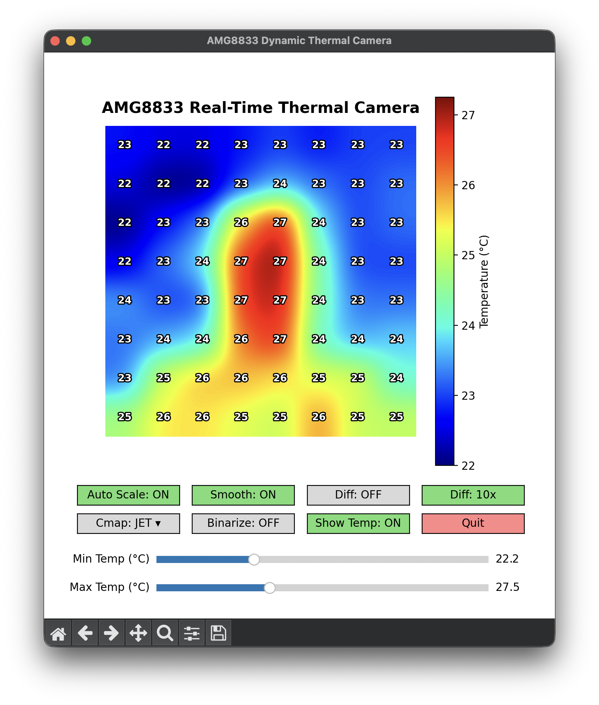
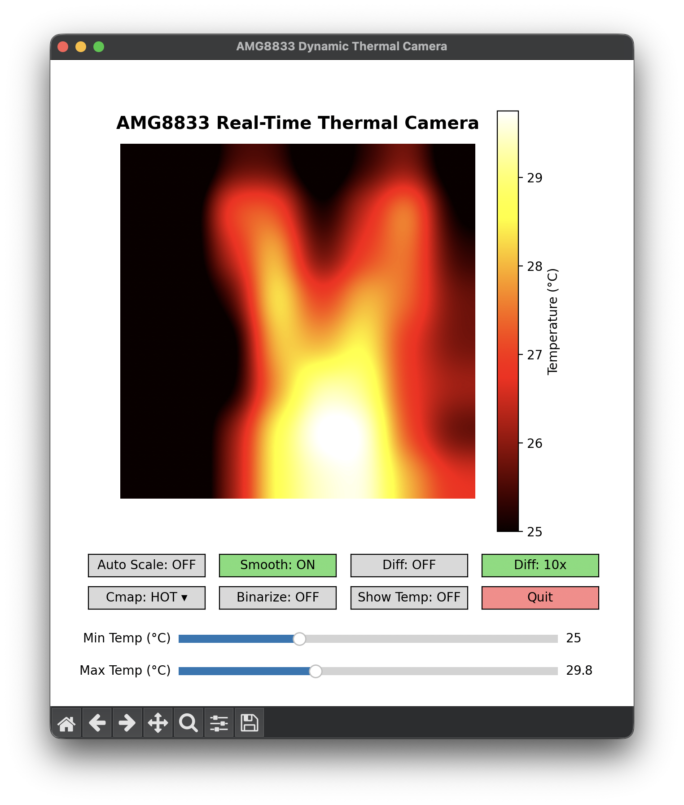

# Python Thermal Camera Viewer

Cross-platform real-time GUI thermal camera viewer for AMG8833 powered by Matplotlib, NumPy, and PySerial.

   

## Features

- **Automatic Serial Port Detection**: Automatically detects Arduino / USB-Serial devices across macOS, Linux, and Windows.
- **Interactive UI Controls**:
  - **Auto Scale**: Toggle automatic dynamic color-scale min/max scaling.
  - **Smooth Interpolation**: Switch between smooth Gaussian interpolation and sharp 8x8 matrix display.
  - **Temperature Overlay**: Display real-time numeric temperatures (°C) directly over pixels.
  - **Colormap Selection**: Dropdown menu offering `JET`, `HOT`, `INFERNO`, `PLASMA`, `COOLWARM`, and `VIRIDIS`.
  - **Binarization & Connected-Component Labeling**: Thresholding with real-time 8-connectivity island labeling.
  - **Frame Difference (Motion Detection)**: Real-time gradient diffing between consecutive frames to highlight motion, with a dedicated **Diff: 10x / 1x** toggle button to magnify subtle changes in both heatmap and numerical overlay.
  - **Dynamic Range Sliders**: Real-time `vmin` and `vmax` temperature range sliders.

### Control Panel Reference

| Control Button | Function |
| :--- | :--- |
| **`Auto Scale`** | Toggle dynamic min/max color-scale adaptation. |
| **`Smooth`** | Toggle Gaussian smoothing vs. raw 8x8 matrix. |
| **`Diff`** | Toggle frame-difference motion detection mode. |
| **`Diff: 10x / 1x`** | Switch motion difference magnification (10x vs 1x). |
| **`Cmap ▾`** | Select colormap from dropdown menu (`JET`, `HOT`, `INFERNO`, etc.). |
| **`Binarize`** | Object thresholding and connected-component labeling. |
| **`Show Temp`** | Display numerical temperature/label on each pixel. |
| **`Quit`** | Safely close the viewer and release serial port. |
| **Sliders (`Min / Max Temp`)** | Manually adjust colorbar temperature limits (°C). |

## Prerequisites & Installation

```bash
pip install -r requirements.txt
```

## Running the Viewer

Ensure your Arduino (with `sketch_amg8833.ino`) is plugged into your computer via USB, then run:

```bash
python viewer.py
```
