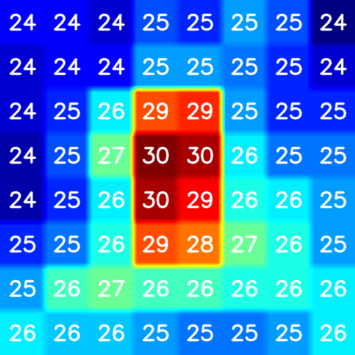
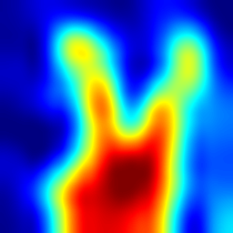
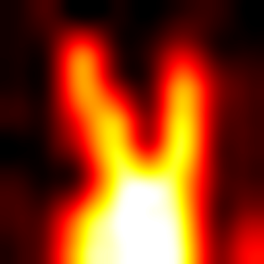
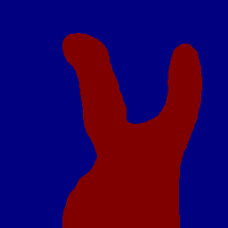
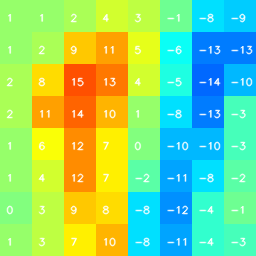

# Raspberry Pi C++/OpenCV3 Native Viewer (Maintenance Mode)

> **Status: Maintenance Mode**  
> This native C++/OpenCV3 implementation for Raspberry Pi 3 was personally written and hand-crafted by the author in **2019** (in the pre-generative AI era) and is now kept in maintenance mode as a reference.  
> For active cross-platform development (Mac, Linux, Windows), please use the [Python GUI Viewer](../python/README.md) or see the main [README.md](../README.md).

---

## Development Environment

- Raspberry Pi 3
- Raspbian OS
- g++ compiler and Make
- OpenCV 3 (must be installed/built on Raspberry Pi 3)

*Note: Building OpenCV 3 from source on Raspberry Pi 3 can take a significant amount of time.*

## Architecture

```
[GUI/RasPi3] /dev/ttyACM0 ---- VCP/USB ---- [Arduino UNO] ---- I2C ---- [AMG8833]
```

## Building and Running

```bash
$ cd raspi
$ make
$ bin/thermo -m 64 -t -b
```



### Command Line Options

```
Usage: thermo [OPTION...]

   -t                   show thermography with temperature overlaid
   -m magnification     magnify image (default: 16)
   -i repeat            repeat bicubic interpolation (4^repeat magnified)
   -b                   enable blur effect
   -d                   enable diff between frames
   -B                   enable binarization
   -H                   enable COLORMAP_HOT (default is COLORMAP_JET)
   -?                   show help
```

---

## Feature Details

### Bicubic Interpolation

The resolution of the AMG8833 sensor is 8x8 pixels. Bicubic interpolation is applied to the original 8x8 pixel image for higher resolution.



```bash
$ bin/thermo -m 1 -i 3
```

With the `-H` option, the GUI uses `COLORMAP_HOT` instead of `COLORMAP_JET`:



```bash
$ bin/thermo -m 3 -i 2 -H -b
```

### Binarization

The GUI supports binarization, useful for object segmentation or counting people in a room:



```bash
$ bin/thermo -m 32 -H -B
```

### Frame Difference: Motion Detection (Velocity Gradient)

The GUI supports image diff between consecutive frames, useful for detecting movement:



```bash
$ bin/thermo -m 32 -d
```
